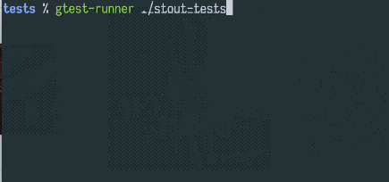
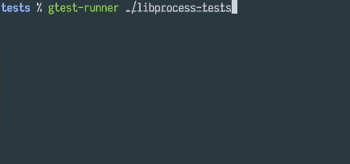

gtest-runner 
============

A parallel test runner for [googletest](https://github.com/googletest).

Screenshots
-----------

For successful runs only minimal output is shown.

If a test fails its log is shown.

Usage
-----

    USAGE:
        gtest-runner [OPTIONS] <test_executable>...

    FLAGS:
        -h, --help       Prints help information
        -V, --version    Prints version information

    OPTIONS:
        -j, --jobs <jobs>     [default: 8]

    ARGS:
        <test_executable>...

Installation
------------

Installation requires a recent rust compiler.

    cargo install --git https://github.com/bbannier/gtest-runner

